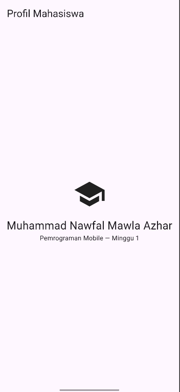
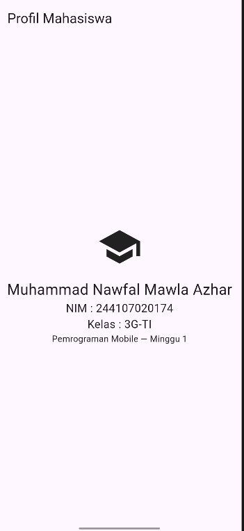

# MINGGU 1 PEMROGRAMAN MOBILE
**Nama : Muhammad Nawfal Mawla Azhar**
**Kelas : 3G-TI**
**NIM : 244107020174**

## ------TUGAS LATIHAN MANDIRI---
```dart
void main() {
  double luas = hitungLuasPersegiPanjang(10.5, 5.0);
  print('Luas Persegi Panjang: $luas');

  Profil mahasiswa = Profil(nama: 'Muhammad Nawfal Mawla Azhar', nim: '244107020174');
  String emailTampil = mahasiswa.email ?? 'Email belum diisi';
  print('Nama: ${mahasiswa.nama}, NIM: ${mahasiswa.nim}, Email:$emailTampil');
}

double hitungLuasPersegiPanjang(double panjang, double lebar) => panjang * lebar;

class Profil {
  String nama;
  String nim;
  String? email; 
  Profil({required this.nama, required this.nim, this.email});
}
```


## -----Hasil dari UI Setelah Dirombak Ulang--------

### Pada Praktikum kali ini setelah mengubah UI akan Memunculkan Nama Saya di dalam Aplikasi mobile



## ---Mini Assigment---
### Setelah Menambahkan beberapa informasi maka akan menampilkan data tambahan yakni NIM saya dan Kelas Saya
