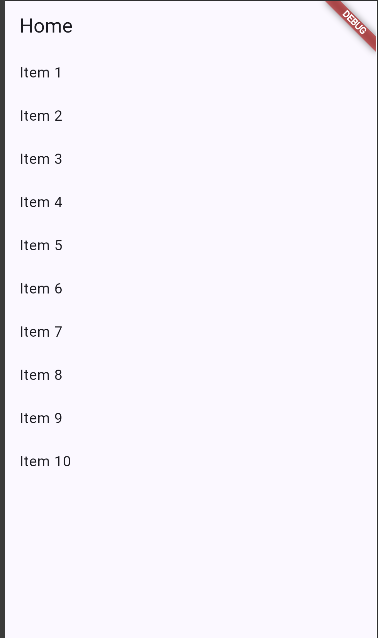
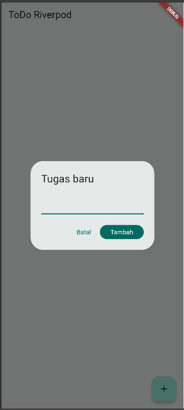
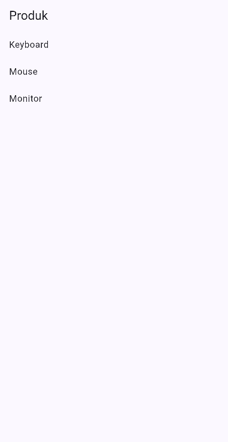
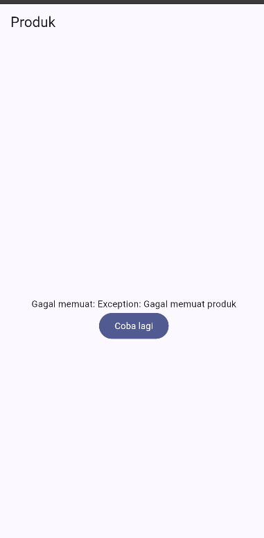
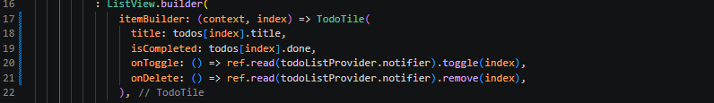
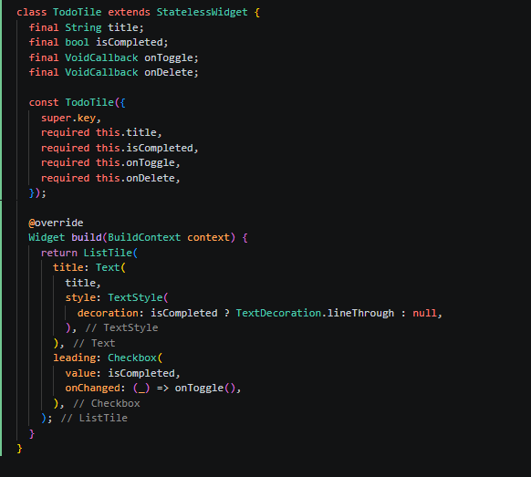

# Laporan Praktikum Minggu 3 - Navigation state Management

---

## Identitas Mahasiswa 
* **Nama:** Muhammad Nawfal Mawla Azhar
* **NIM:** 244107020174
* **Kelas:** 3G-TI

---

## 1. Aplikasi Multi page dengan GoRouter

**Screenshot Hasil Run:**

ScreenShoot Page Home :
> 

ScreenShoot Page Detail:
> 

## 2. Aplikasi ToDo dengan Riverpod

ScreenShoot Page Home :
> 

ScreenShoot Page Detail:
> 

## 3.  asyncValue: Loading, error, success

ScreenShoot Hasil Run Sukses
> 

**Penjelasan**
Saat Menjalankan Aplikasi Usera kaan melihat lingkarn loading berputar selama beberapa detik lalu memunculkan daftar barang (keyboard, mouse dan monitor)

ScreenShoot Hasil Run Gagal
> 

**Penjelasan**
Saat (return[keyboard...]) di ganti menjadi Throw exception('gagal terhubung ke server'), maka akan memunculkan pesan yang menunjukan  gagal memuat

ScreenShoot Hasil Run Gagal lalu load ulang
> 

**Penjelasan**
Saat Mengeklik tombol muat ulang di dalam aplikasi maka akan terload kembali barang yang ada (mouse, keyboard dan komputer)

**Penjelasan Refleksi  (poin4)**
Hal tersebut berkaitan dengan User Experince, Mengosongkan layar dan menggantinya dengan ikon loading  besar di tengah layar akan membuat pengguna merasa terganggu dan kehilangankonteks apa yangsedang mereka baca, Dengan membiarkan data lama tetap terlihat sambil menampilkan indikator loading kecil di atas, pengguna bisa membaca konten sebelumnya meskipun aplikasi sedangmengambil data terbaru

## 4. AI Challenge

**Apakah state diubah secara immutable?**

Ya. Kode AI tidak melakukan mutasi langsung (misalnya state.value.add()). State selalu diganti dengan instansiasi AsyncValue baru melalui baris state = const AsyncValue.loading() dan state = await AsyncValue.guard(...).

**Apakah ref.watch hanya dipakai di dalam build, dan ref.read di callback?**

Ya. Pemantauan data dilakukan menggunakan ref.watch(statsProvider) murni di dalam metode build(). Sementara itu, aksi klik tombol retry menggunakan ref.read(statsProvider.notifier).retry() di dalam callback onPressed.

**Apakah ketiga state AsyncValue benar-benar ditangani?**

Ya. Metode statsAsyncValue.when() mendefinisikan dengan jelas blok loading: (mengembalikan spinner), blok error: (mengembalikan icon gagal, pesan error, dan tombol retry), serta blok data: (mengembalikan daftar ListView).

**Apakah provider dideklarasikan dengan tipe eksplisit?**

Ya. Provider ditulis menggunakan spesifikasi <StatsNotifier, List<String>> yang kokoh, sehingga tipe datanya jelas dan tidak ambigu.

**Apakah kode AI memakai API Riverpod versi lama?**

Tidak. Kode sudah menggunakan AsyncNotifier dan AsyncNotifierProvider yang merupakan standar modern (versi terbaru Riverpod 2.0+), meninggalkan StateNotifierProvider yang sudah mulai usang.

## 5. Refactoring and Testing

Mengurangi Kode di Bagian Main : 
> 

Menambahkan Class baru di bawah kode yang sudah ada :
> 

## 6. Tugas, Refleksi dan referensi

1. Kapan setState masih cukup, dan kapan state harus naik ke Riverpod?

- setState masih cukup digunakan untuk status lokal yang hanya beroperasi dan berdampak pada satu widget tunggal, contohnya animasi loading pada satu tombol spesifik

- Riverpod diperlukan saat state tersebut adalah status global yang perlu dibagikanatau diakses oleh berbagai halaman berbeda

2. Apa perbedaan context.go dan context.push, dan kapan masing-masing tepat digunakan?

- context.go Berpindah ke rute baru dengan mengganti tumpukan riwayat jalaman yang ada berdasarkan definisi URL

- context.push Menupuk halaman baru di atas halaman saat ini (digunakan untuk melihat halaman detail)

3. Bagaimana AsyncValue mencegah bug dibanding tiga boolean terpisah?

- Jika menggunakan tiga boolean terpisah, makaakan sangat mudah terjadi bug keadaan tidak konsisten, maka lebih baik menggunakan konsep union type

4. Bagian Mana dari hasil AI yang ada perbaiki ?

- tipe data Array pada test : AI memberikan return list kosongpada penanganan error di file file test, yang menyebabkan error type mismatch karena Dart membacanya sebagai List<dynamic>, sementara providersecara ketat meminta List<string>

- Jalur import File yang salah : AI terkadang masih memberikan rute import yang relatif salah,  sehingga akan ditolak saat dipanggil dalam folder test

