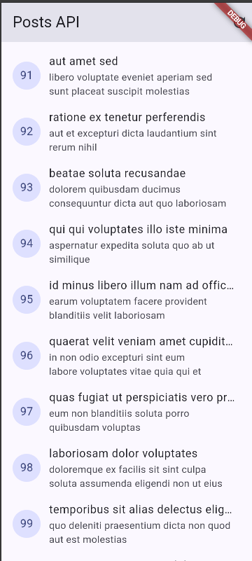
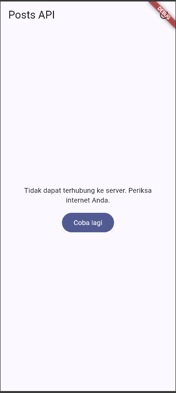
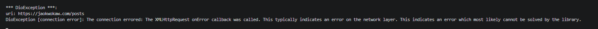
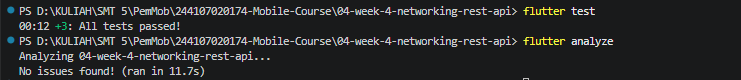
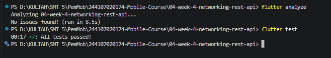
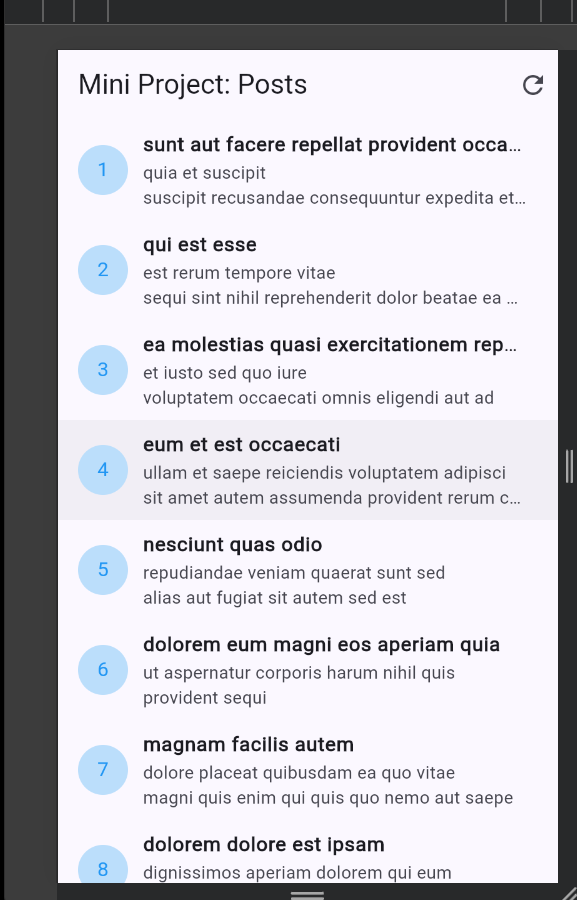
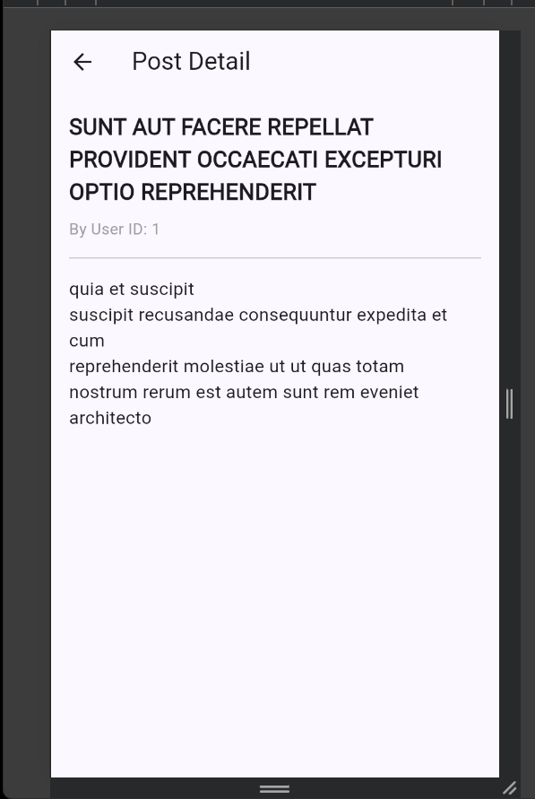

# Laporan Praktikum Minggu 4 - Networking rest API

---

## Identitas Mahasiswa 
* **Nama:** Muhammad Nawfal Mawla Azhar
* **NIM:** 244107020174
* **Kelas:** 3G-TI

---

## Praktikum 1- 3 

**Screenshot Hasil Run:**

ScreenShoot Skenario pertama (Normal) :
> 

**Penjelasan**
Aplikasi Berjalan Sesuai yang diinginkan

ScreenShoot Skenario Kedua (Menghilangkan Internet Pada Gadgwt) :
> 

**Penjelasan**
Aplikasi Akan menampilkan Pemberitahuan Tidak dapat Terhubung ke server, dan jika Internet di dalam Gadget kita dinyalakan lagi saat mengeklik muat ulang, akan menampilkan halaman yang serupa seperti Skenario Pertama

ScreenShoot Skenario Ketiga (Mengganti URL):
> 

**Penjelasan**
Aplikasi akan tidak bisa tersambung ke server karena URL yang salah

## AI CHALLENGE

**Hasil ScreenShoot Hasil Test kode Setelah AI prompt**
> 

hasil ScreenShoot menunjukkan bahwa tidak ada masalah dari kode yang sudah di implementasikan

## REFACTORING

**Hasil Setelah Melakukan Refactoring**
> 

Hasil ScreenShoot menunjukan tidak ada masalah setelah melakukan refactoring

## TUGAS

**ScreenShoot Dari Home**
> 

**ScreenShoot Dari Detail**
> 

## REFLEKSI

1. UI seharusnya hanya mengatur tampilan, jika UI memanggil Dio Langsung maka kode API dan tampilan akan tercampur sehingga sulit untuk dirawat dan diuji

2. Pagination client-side cikup untuk data yang sedikit dan sudah ada di aplikasi, jika datanya banyak atau terus bertambah lebih baik memakai _page dan _limit agar aplikasi hanya mengambil data yang diperlukan

3. Riverpon otoamtis mengubah exception dari repository menjadi AsyncError, Jadi, widget cukup menangani loading, error dan data tanpa memiliki try/catch di setiap halaman

4. Saya memperbaiki struktur kode Riverpod yang dihasilkan oleh AI pada bagian commentsProvider. AI awalnya merekomendasikan penggunaan AutoDisposeAsyncNotifierProviderFamily yang dikombinasikan dengan deklarasi class manual AutoDisposeFamilyAsyncNotifier. Hal ini menyebabkan error syntax (class tidak dikenali) pada versi Riverpod yang saya gunakan. Saya memperbaikinya dengan mengubahnya menjadi pendekatan FutureProvider.autoDispose.family.
