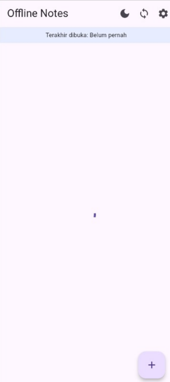
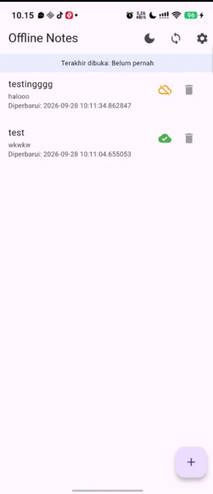

# Laporan Praktikum Minggu 5-Local Storage Offline First

---

## Identitas Mahasiswa 
* **Nama:** Muhammad Nawfal Mawla Azhar
* **NIM:** 244107020174
* **Kelas:** 3G-TI

---

## DOKUMENTASI SCREENSHOOT

**Screenshot Hasil Run:**

> 

> 

## Refleksi

### 1. Mengapa daftar catatan tidak boleh disimpan di SharedPreferences?

Karena SharedPreferences hanya cocok untuk data sederhana berupa key-value. Kalau daftar catatan disimpan di sana, semua data harus diubah menjadi JSON dan akan sulit saat mencari, mengubah, atau menghapus satu catatan. SQLite lebih cocok untuk kebutuhan CRUD.

### 2. Kapan cache-first cukup?

Cache-first cukup untuk data yang tidak harus selalu terbaru, seperti catatan. Untuk data seperti harga, stok, atau status pembayaran, lebih baik menggunakan network-first agar data yang ditampilkan tetap terbaru.

### 3. Bagaimana dirty flag menjadi antrean sync tanpa memblokir UI?

Saat ada perubahan, data langsung disimpan ke lokal dan diberi `dirty = 1`. UI tidak perlu menunggu proses server. Saat sync berjalan, catatan dirty diproses lalu diubah menjadi `dirty = 0`. Tabel outbox diperlukan jika setiap operasi create, update, dan delete harus dicatat serta bisa diulang ketika gagal.

### 4. Bagian rekomendasi AI yang ditolak

Saya menolak rekomendasi penggunaan Drift atau Hive untuk penyimpanan utama catatan dalam skala tugas praktikum dasar ini, dan memilih SQLite murnia