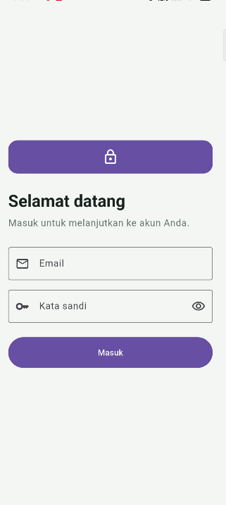
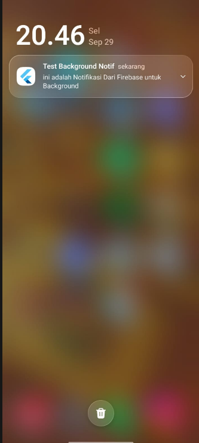
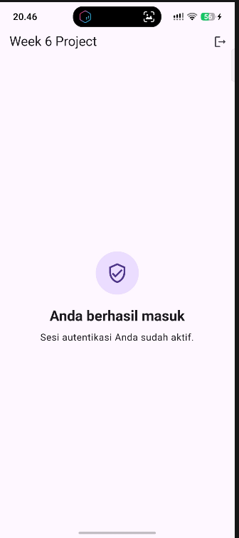
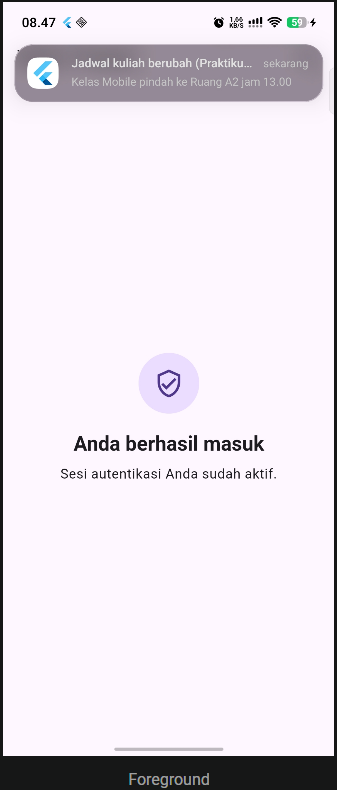
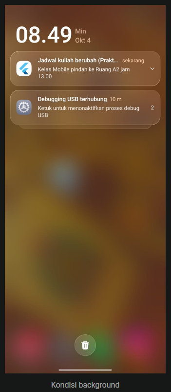
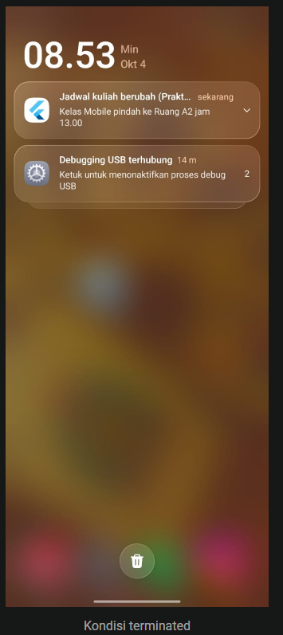

# Week 6 - Authentication, Security & FCM

**Nama:** Muhammad Nawfal Mawla Azhar
**NIM:** 244107020174
**Kelas:** TI - 3G

## Tujuan Pembelajaran

Setelah menyelesaikan codelab ini, saya dapat:

- menjelaskan alur Firebase Auth, JWT, OAuth, dan Google Login serta perbedaan ID token, access token, dan refresh token;
- menyimpan token menggunakan secure storage dan memahami proses refresh token otomatis;
- menjelaskan hubungan app server, Firebase Cloud Messaging (FCM), dan perangkat;
- meminta permission notifikasi dan mengelola lifecycle token melalui `getToken` serta `onTokenRefresh`;
- membedakan notification payload dan data payload pada kondisi foreground, background, dan terminated;
- menangani klik notifikasi menggunakan deep link GoRouter serta menggunakan topic messaging;
- menerapkan keamanan dasar, seperti tidak menyimpan secret di source code dan tidak mencetak token ke log.

## Perilaku pada Tiga State Aplikasi

| State      | Perilaku                                                                                    | Handler yang digunakan        |
| ---------- | ------------------------------------------------------------------------------------------- | ----------------------------- |
| Foreground | `onMessage` menerima pesan dan aplikasi menampilkan local notification.                     | `FirebaseMessaging.onMessage` |
| Background | Sistem menampilkan notifikasi. Saat notifikasi diklik, aplikasi membuka route dari payload. | `onMessageOpenedApp`          |
| Terminated | Aplikasi dibuka dari keadaan mati dan membaca pesan awal untuk melakukan deep link.         | `getInitialMessage`           |

## Dokumentasi Screenshot

### Praktikum 1

> Dokumentasi setup dan token FCM.

> 

### Praktikum 2

> Pengujian pengiriman notifikasi dari Firebase Console.

> Hasil notifikasi yang diterima aplikasi.

> 

> Hasil setelah membuka aplikasi lewat notifikasi

> 

### Praktikum 3

> Pengujian notifikasi saat aplikasi berada di foreground.

> 

> Pengujian notifikasi saat aplikasi berada di background dan setelah diklik.

> 

> Pengujian notifikasi saat aplikasi berada di terminated dan setelah diklik.

> 

## Refleksi & tugas

1. Mengapa refresh token tidak boleh disimpan di SharedPreferences? Apa risikonya bila bocor?

    Refresh token tidak boleh disimpan di SharedPreferences karena data di dalamnya disimpan dalam bentuk teks biasa (plain text / XML) tanpa enkripsi. Jika perangkat di-root atau ada aplikasi berbahaya yang berhasil membaca penyimpanan tersebut, refresh token dapat dengan mudah dicuri. Risikonya, peretas bisa menggunakan refresh token tersebut untuk terus-menerus meminta access token baru dan membajak sesi akun pengguna tanpa batas waktu, tanpa perlu mengetahui username dan password korban.

2. Apa yang rusak bila onTokenRefresh diabaikan selama satu semester perkuliahan?
    FCM Token bersifat dinamis dan bisa kedaluwarsa atau di-reset oleh sistem (misalnya karena update aplikasi, clear data, atau kebijakan keamanan Google). Jika onTokenRefresh diabaikan, aplikasi tidak akan pernah mengirimkan token yang baru ke backend (server). Akibatnya, server kampus akan terus mengirimkan notifikasi ke token lama yang sudah mati (token basi), dan mahasiswa tersebut tidak akan menerima notifikasi apa pun (seperti jadwal pengganti atau peringatan DO) selama satu semester penuh.

3. Kapan memakai topik dan kapan memakai token perangkat? Beri contoh pesan kampus untuk masing-masing.

    Topik (Topic): Digunakan untuk pesan broadcast berskala besar kepada kelompok tertentu tanpa perlu mengetahui ID perangkat mereka satu per satu.

        Contoh: Pengumuman libur nasional, informasi pendaftaran wisuda, atau pesan ke topik pengumuman-kampus.

    Token Perangkat (Device Token): Digunakan untuk pesan privat yang sangat spesifik dan rahasia yang hanya ditujukan untuk satu pengguna/mahasiswa saja.

        Contoh: Notifikasi "Tagihan SPP Anda kurang Rp 500.000", peringatan "Jatah absen mata kuliah Pemrograman Mobile tersisa 1", atau pengumuman nilai KHS.

4. Bagian mana dari draf AI yang Anda tolak atau perbaiki, dan mengapa?
    Saya memperbaiki bagian penanganan rute (routing) dari AI. Pada draf awal, seringkali AI menyarankan penggunaan BuildContext atau pemanggilan UI langsung di dalam fungsi background handler. Saya menolak/memperbaiki hal tersebut dengan memindahkan eksekusi navigasi (GoRouter) ke dalam main.dart melalui mekanisme callback, karena fungsi background berjalan pada isolate (alur memori) yang terpisah dan secara teknis dilarang mengakses elemen antarmuka (UI) maupun status Riverpod secara langsung. Selain itu, saya juga mengganti URL contoh (api.example.com) dengan struktur API backend yang relevan dengan tugas.